# Overview

This is a tool for the testing and development of Android apps that use GPS. It allows the user to set a single location on the map to mock, or build a route to follow with multiple points.

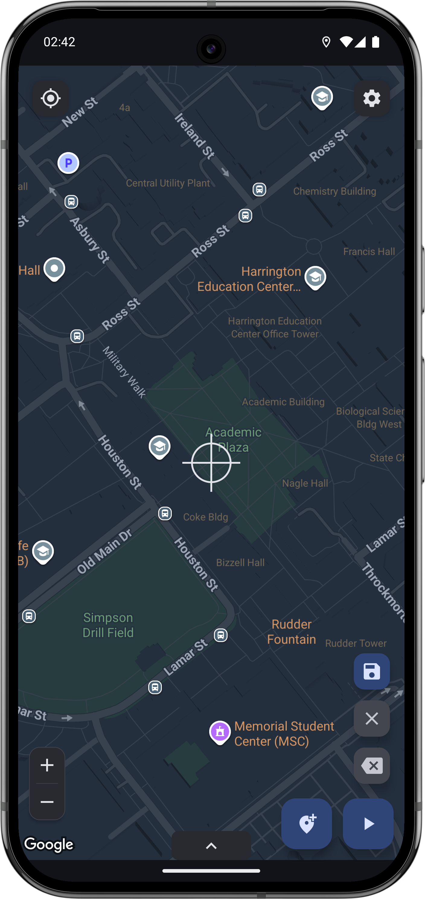

 

# Intended Use

This app is intended **for development and testing purposes only**.
It uses Android’s official mock location APIs and requires the app to be
set as the system’s mock location provider.

It is not intended to bypass app restrictions, cheat in games,
or evade location-based safeguards in third-party services.

Other apps may be able to detect that a mock location provider is being used.

# Requirements

- Android 12 (API 31) or later
- Developer Options enabled
- This app set as the system mock location app
- Location permission granted
- Notification permission (Android 13+ recommended)

# Background Behavior

- Mocking continues if the app is closed
- A persistent notification is shown while mocking is active when the notification permission is granted
- If the service is stopped unexpectedly, mocking resumes when the app is reopened
- Stopping mocking returns the device to its real GPS location

# Permissions Explained

- **Location** – Required to show your real location, and mocked location while mocking
- **Notifications** – Required to display a persistent notification while mocking is active
- **Developer Options / Mock Location App** – Required by Android to allow location simulation

# App Setup

When attempting to perform an action for the first time that requires permissions, prompts for those permissions are shown.

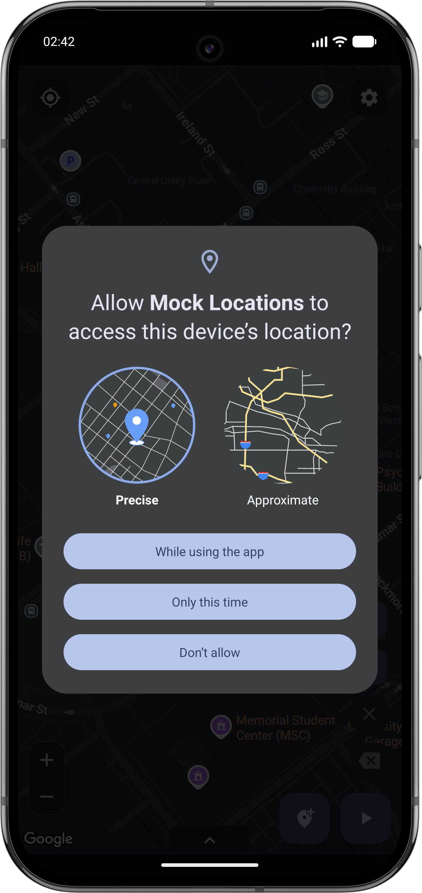
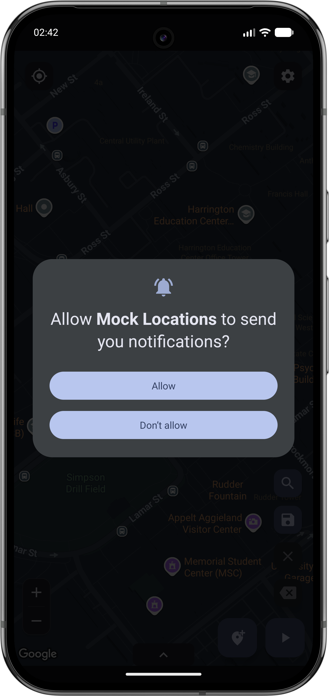
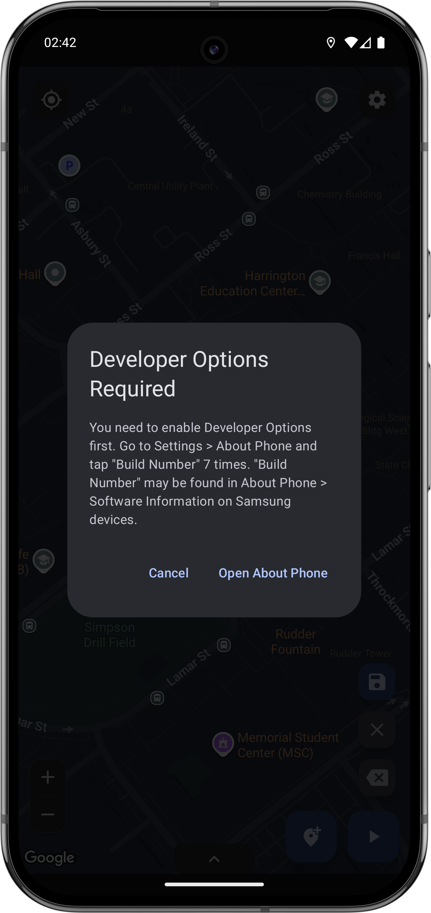
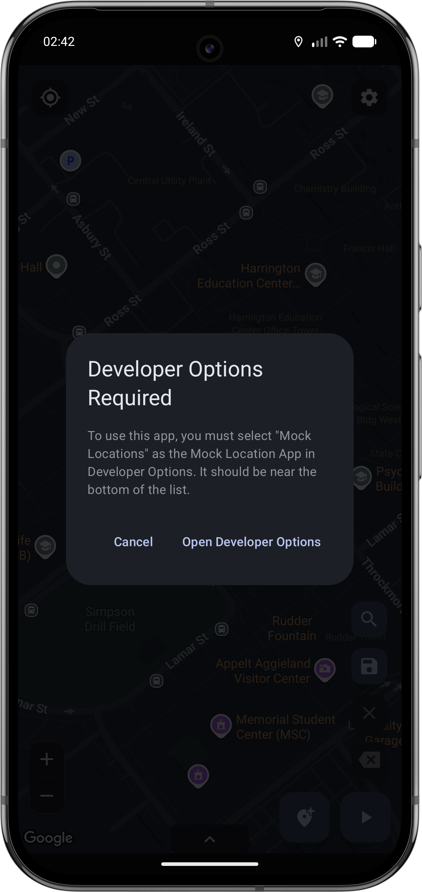

 

# Controls

### Start mocking

Starts the mock location service. This service will continue running until the stop button is pressed. If the mocking service stops unexpectedly, it will resume in the same place when the app is opened again.

### Stop mocking

Stops the mock location service. Your device will resume using its actual GPS location.

### Pause mocking

Pauses the movement of the route that is currently running. The mock location service remains active, showing you at that location on the route until the start or stop mocking buttons are pressed.

### Add point

Adds a point on the map at the location of the crosshairs. This button is not visible when the "use crosshairs" setting is disabled.

### Saved routes

Shows a dialog for the routes you have saved, and an option to save the current route on your map.

### Clear route

Removes all points on the map.

### Remove point

Removes the most recently placed point on the map.

### Expanded controls
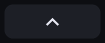

Opens expanded controls section.

 

# Location mocking

Mocking a point keeps your location in the same place until it is stopped. If the notification permission is granted, a notification is shown as long as the mocking service is running. The notification has a button to stop mocking your location. The mocking continues if the app is dismissed, but in the event that the service is stopped unexpectedly, the mocking is resumed in the same place when the app is opened again.

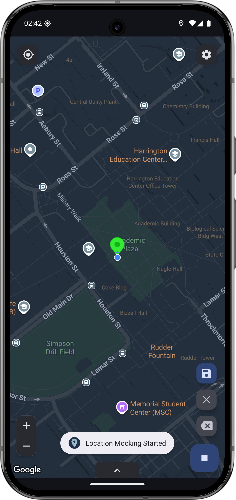
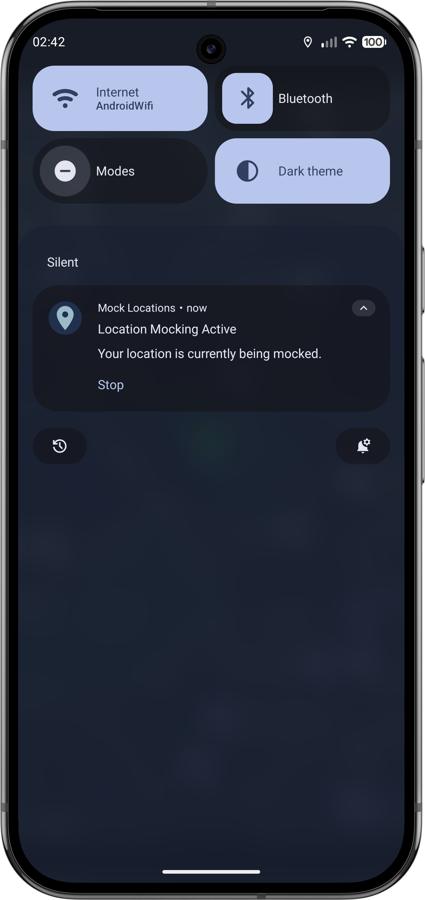

 

Adding more points builds a route. This can be done by using the "add point" button to add a point at the crosshairs location, or by long pressing on the map.

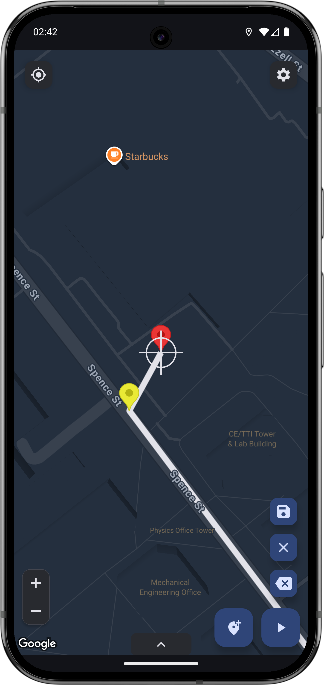

 

Pressing start starts the mock location service, and it follows the route built at the given speed. Tapping on the tab at bottom center opens the expanded controls, which has a slider to adjust the speed that the route is followed when mocking. When mocking a route, the pause button is available. This button pauses the movement of the device's mocked location. The location appears as that location on the map until the route is resumed, or mocking is stopped. There are also buttons to pause the route or stop mocking in the notification. If the mocking service is stopped unexpectedly, it will resume where the route left off when the app is opened again.

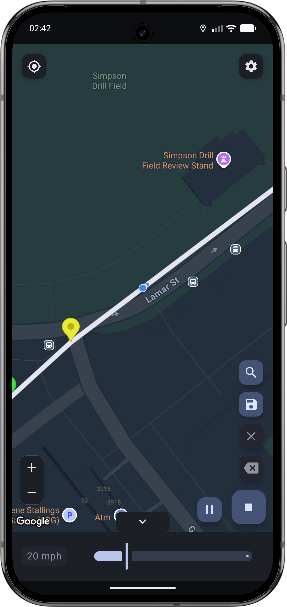
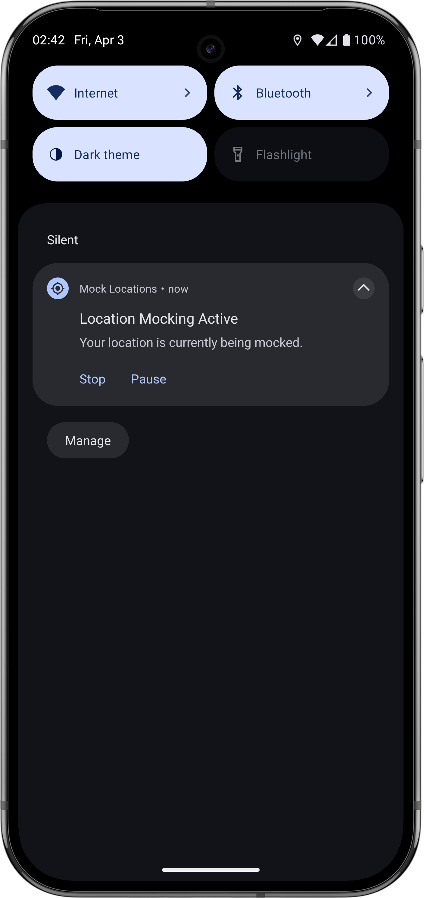

 

# Saving routes
Tapping the "saved routes" button opens a dialog showing your saved routes. Tapping on "Save Route" navigates to the next page, where the route is given a name and saved. There cannot be multiple routes with the same name. The distance unit shown in the saved routes dialog is based on the unit selected in the expanded controls configuration screen.

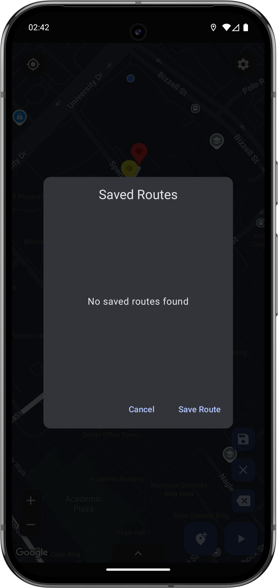
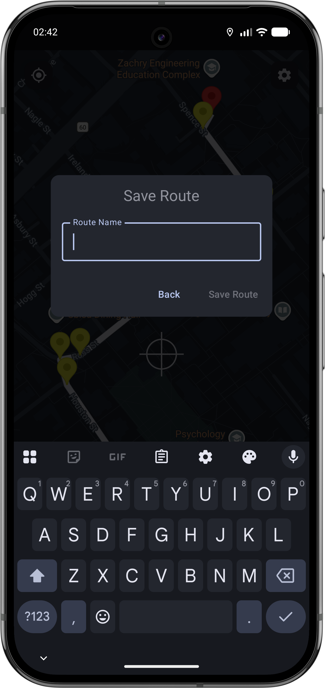
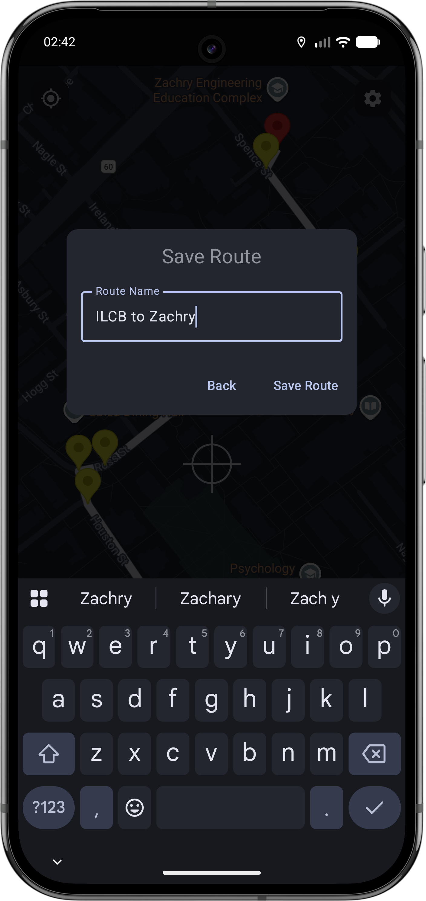
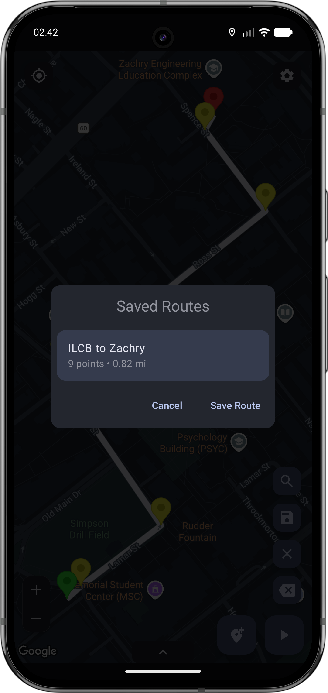

 

Tapping and holding on a saved route in the list selects the route, and shows a button to delete the selected routes.

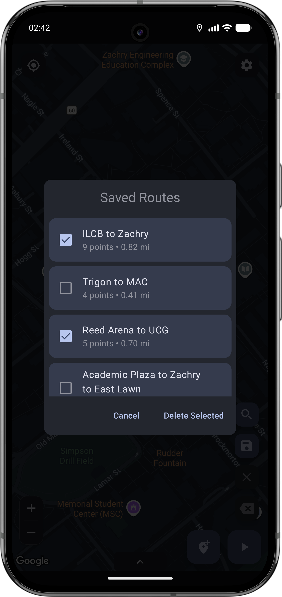

 

# Expanded controls configuration
The speed unit for mocking a route and range for the slider in the expanded controls can be set on this screen, which to can navigate to from the main settings screen. The values for the upper and lower end of the slider must be positive whole numbers, between 0 and 2,147,483,647 inclusive. The lower end must be lower than the upper end. The speed unit options are kilometers per hour (km/h), meters per second (m/s), and miles per hour (mph). Selecting km/h or m/s on this screen displays the route length in kilometers in the saved routes dialog. Likewise, selecting mph displays the route length in miles.

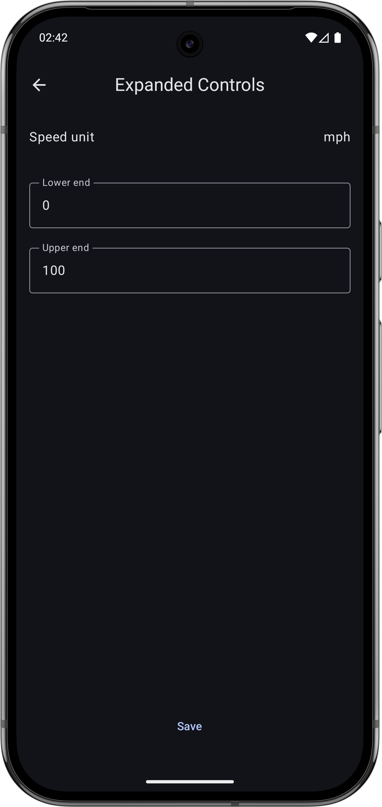

 

# Export and import settings
From the main settings screen, there are options to export or import settings. This makes it easy for testing the same routes and keeping your preferences across multiple devices or between device resets. You have the option to export just the settings, just the routes, or both, as a JSON file. See an example JSON export file [here](docs/mock_locations_2026_04_10_13_32_57.json).

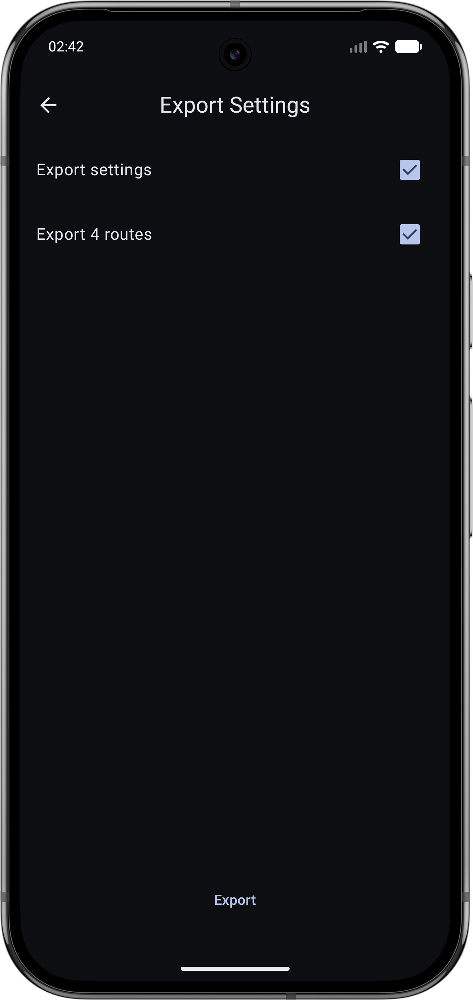
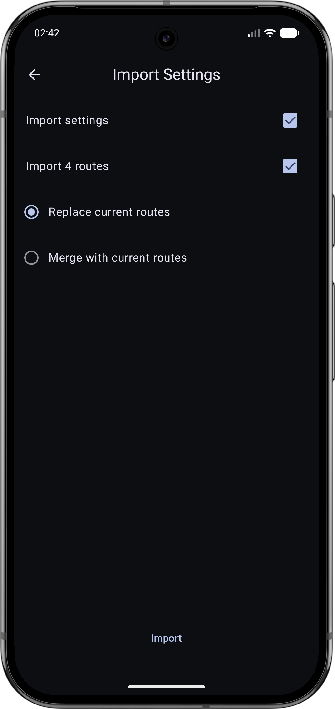

 

If there are no settings or no routes in the JSON to import, that section of the UI will be disabled.

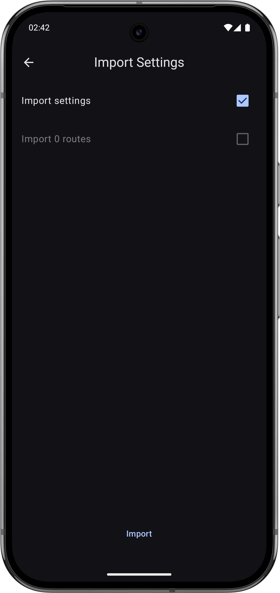

 

# Settings

### Use crosshairs
This is enabled by default. Turning it off will remove the crosshairs marker that is shown in the center of the map screen. With it off, the "add point" button will not show, so adding points to the map is only done by long pressing on the map.

### Clear route on stop
This is enabled by default. With it on, the route or point being mocked will be cleared when the stop button is pressed or the route is completed.

## Camera follows mocked location
This is enabled by default. With it on, the map's camera follows the current mocked location while mocking a route. This makes it so that the mocked location stays in the middle of the screen as it moves. Panning or zooming on the map while mocking with this option enabled prevents the camera from following the route, until another route is started.

## Wait at the end of a route
This is disabled by default. Similar to pausing in the middle of mocking a route, the location continues to be mocked at the final point on a route until the stop button is pressed.

## Map style
Options for different color themes for the map: Default (follows system theme), Aubergine, Dark, Night, Retro, Silver, Standard.

## Location accuracy level
Options for adding noise to the location to be mocked: Perfect (0 m), High (5 m), Medium (10 m), Low (20 m). This distance represents how far off the mocked location is set from the point or route selected.

## Location update delay
The time in seconds between location updates sent by the mocking service.
